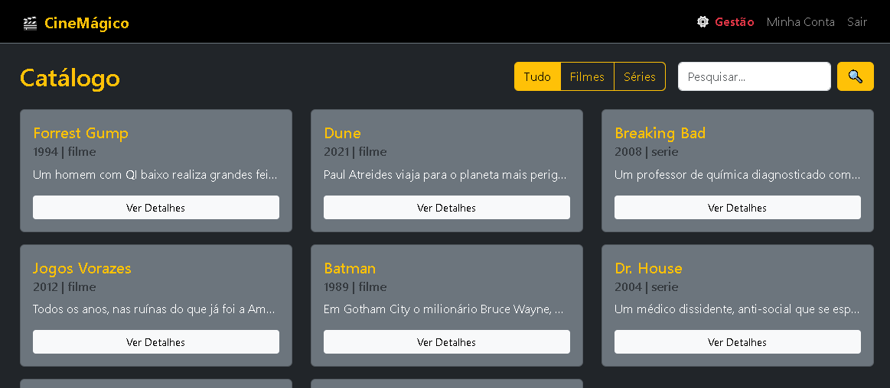
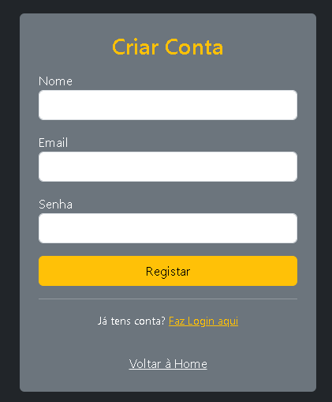
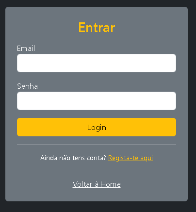
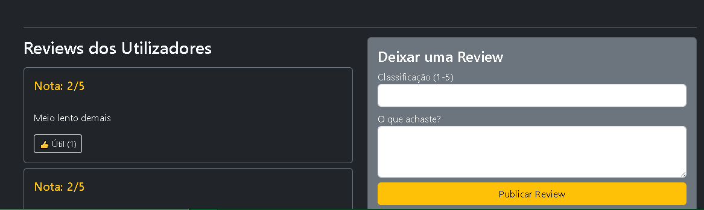
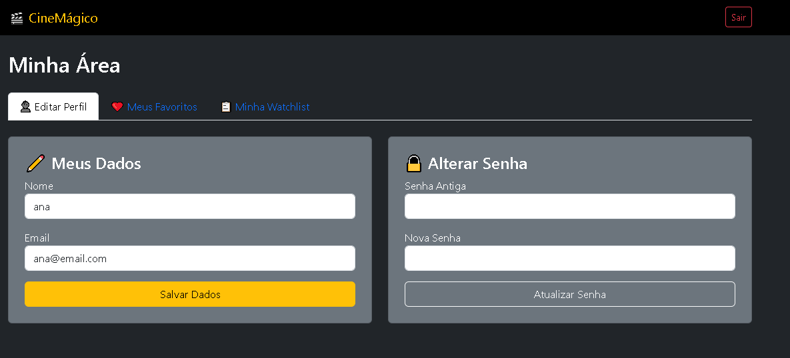
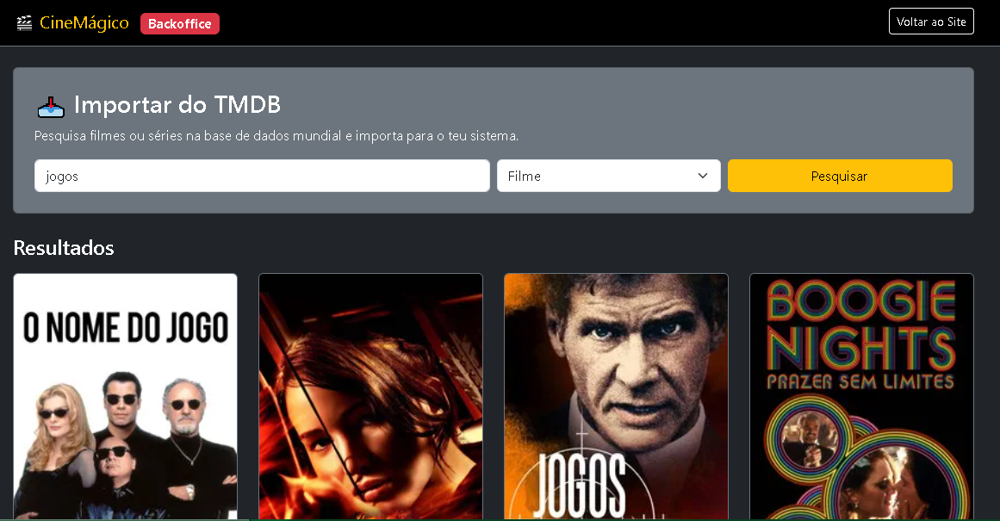
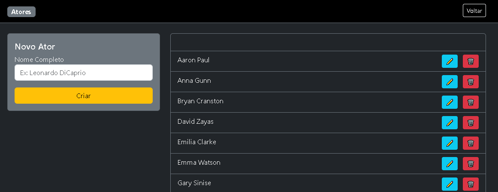

# MANUAL UTILIZADOR

## Projeto: Gestão de Filmes e Séries
URL de Acesso: http://localhost:8080

## 1. Introdução
Bem-vindo ao sistema de Gestão de Filmes e Séries. Esta aplicação web permite-lhe explorar um vasto catálogo de entretenimento, criar as suas próprias listas, avaliar conteúdos e, através da área de gestão, administrar toda a base de dados de filmes, atores e realizadores.

## 2. Acesso e Autenticação
### 2.1. Ecrã Inicial e Catálogo
Ao aceder à aplicação, será recebido pela página inicial onde são listados os filmes e séries disponíveis no sistema. Qualquer visitante pode visualizar o catálogo.

Barra de Pesquisa: No topo, pode filtrar filmes pelo título.
Filtros: Utilize os botões para alternar entre "Todos", "Filmes" ou "Séries".

### 2.2. Criar Conta (Registo)
Para aceder às funcionalidades avançadas (como favoritos e gestão), é necessário criar uma conta.

- Clique em "Login" na barra de navegação superior.
- Selecione a opção "Regista-te aqui".
- Preencha os campos: Nome, Email e Senha.
- Clique em confirmar. Será redirecionado para o login.

### 2.3. Login
Insira o seu email e senha registados.

Ao entrar, a barra de navegação mudará, mostrando novas opções: "Minha Área" e "Gestão".

## 3. Funcionalidades do Utilizador
Uma vez autenticado, terá acesso a ferramentas de personalização.

### 3.1. Detalhes e Interação
Ao clicar em "Ver Detalhes" num filme ou série, encontrará:

Ficha Técnica: Sinopse, ano, duração e elenco.

❤️ Favoritos: Clique no botão para adicionar aos seus favoritos.

📋 Watchlist: Clique para adicionar à sua lista pessoal ("Para ver mais tarde").

Reviews:

Escrever: Deixe uma nota (1 a 5) e um comentário.

Votar: Achou uma review útil? Clique no "Útil" (👍) nas reviews de outros utilizadores.

### 3.2. Minha Área (Perfil)
No menu "Minha Área", tem controlo total sobre os seus dados:

Editar Perfil: Atualize o seu nome ou email.

Segurança: Altere a sua palavra-passe.

As Minhas Listas: Consulte e faça a gestão (remover itens) dos seus Favoritos e da sua Watchlist.

## 4. Área de Gestão (Backoffice)
Esta área é exclusiva para utilizadores registados e serve para alimentar o site com novos conteúdos.

### 4.1. Importação Inteligente (TMDB)
Não precisa de preencher tudo manualmente. O sistema conecta-se à base de dados mundial do TMDB.

Vá ao separador "Importar TMDB".

Escreva o nome do filme ou série.

O sistema mostrará os resultados com capas.

Clique em "Importar". O filme, a sinopse, o ano e a imagem serão guardados automaticamente na sua base de dados local.

### 4.2. Gestão Manual de Acervo
Se preferir, pode gerir os dados manualmente nos respetivos separadores:

🎬 Filmes e Séries: Adicionar novos títulos, editar informações ou apagar do sistema.

🎭 Atores: Gerir a lista de atores disponíveis.

📢 Diretores: Gerir a lista de diretores disponíveis.

🏷️ Géneros: Criar, editar ou remover géneros (ex: Ação, Drama).

Nota: Ao apagar um Género, Diretor, Ator ou Filmes/Séries tenha cuidado, pois isso pode afetar os filmes associados a eles.